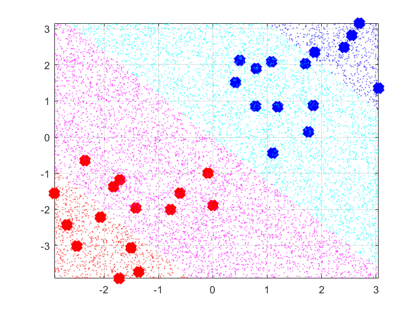

% Esercitazione 2
% Edoardo Ferrante; Federico D'Ambrosio

# Regressione e Classificazione binaria con Kernel Lineare

## Regressione: Retta
Si è cominciata l'esercitazione calcolando l'iperpiano, che nel caso bidimensionale è denotato da una retta, che si adatti al meglio ad un insieme di dati formato da $n$ punti distribuiti casualmente tra $-1$ e $1$ tramite il calcolo di $\underline{w}$, la normale di tale piano.

$\min_{w} ||X \underline{w} - \underline{y}||^2 + \lambda || \underline{w} ||^2 \implies \underline{w}^* = ( X^T X + \lambda I )^+ X^T \underline{y}$

Tale formulazione, che porta alla risoluzione di un problema di complessità quadratica rispetto alla dimensionalità, può essere trasformata in un problema, equivalente, con la complessità dipendente dal numero di campioni a disposizione.

Infatti, tramite il Representer Theorem, considerando $\underline{w} = X^T \underline{\alpha} \iff \underline{w} \in \mathbb{R}^d$, con 

 - $\underline{\alpha}$, un vettore di pesi;
 - le componenenti $\underline{x}_i$ della matrice $X$, formanti una base dello spazio $\mathbb{R}^d$ nel caso in esame $d=1$). 
 
può essere sostituita dalla seguente:


$\min_{\underline{\alpha}} ||X X^T \underline{\alpha} - \underline{y}||^2 + \lambda \underline{\alpha}^T X X^T \underline{\alpha}$
$\underline{\alpha} = ( X X^T + \lambda I )^+ \underline{y}$

La differenza di complessità è evidente nel fatto che l'inversione matriciale è effettuata, nel primo caso, su una matrice $d\,\text{x}\, d$, mentre nel secondo caso su una matrice $n\, \text{x}\, n$

Come ci si aspetta, le 2 formulazioni sono equivalenti e danno lo stesso risultato, con le stesse proprietà, al variare del parametro $\lambda$ e del rumore $\sigma$, rispetto alla precedente esercitazione: con $\lambda$ molto grande la regressione migliore è una retta costante con ordinata $0$, mentre con $\lambda$ piccolo il modello cerca di adattarsi maggiormente ai dati.

## Classificazione: Punti su un piano

Per cominciare, dobbiamo avere dei dati da classificare e, per questo, creiamo una distribuzione bidimensionale ($d=2$ in questo caso) casuale di punti, metà dei quali con etichetta positiva, metà con etichetta negativa.

In questo caso, come nel caso iniziale della retta, sfruttiamo un piano con normale $\underline{w}$, utilizzandolo, però, per permetterci di distinguere tra i punti "positivi" e quelli "negativi".

Anche qui possiamo vedere che, sfruttando l'uguaglianza $\underline{w} = X^T \underline{\alpha}$, è possibile cambiare la complessità del problema, facendola dipendere sia dalla dimensionalità, sia dal numero di dati, senza che cambi il risultato.

Per quanto riguarda i risultati, in maniera analoga al caso $d=1$, con $\lambda$ molto grande si ha l'abbattimento della pendenza dell'iperpiano, quasi piatta, che non ci permette di classificare con probabilità significativa i campioni, mentre con $\lambda$ più piccolo la pendenza aumenta e ci permette di classificare meglio i campioni: i campioni nella zona rossa (YF<-1) e nella zona blu (YF>1) sono quelli che, con maggiore probabilità, possiamo classificare rispettivamente con etichetta negativa ed etichetta positiva.



\pagebreak

# Regressione e Classificazione binaria con Kernel Gaussiano

## Regressione: Sinusoide

Visto che il metodo funziona con ciò che abbiamo visto, vogliamo provarlo come regressore di una funzione non lineare e testare le potenzialità del $\text{KRLS}$.
Formiamo l'ormai familiare vettore $X$ di tutti i dati, di cardinalità $n$, distribuiti linearmente tra $-1,1$ e costruiamo $Y = sin(5X)$ soggetta ad un rumore gaussiano pesato con una data $\sigma$.

Nel problema di minimizzazione introduciamo le $\phi(x_i)$, ovvero funzioni mappanti che proiettano lo spazio del dominio delle $x_i$ in un altro di dimensione maggiore.

Chiamiamo $\Phi$ il vettore delle $\phi(x_i)$ e $Q(i,j) = \Phi^T(x_i)\Phi(x_j)$.

Utilizzando il kernel gaussiano $K(\underline{x}_i,\underline{x}_j)= e^{-\gamma||\underline{x}_i - \underline{x}_j||^2}$. Quindi, sostituiamo $X^TX$ con $Q$ e otteniamo:

$y_f = \sum_{i} \alpha_i\, K(\underline{x}_i, \underline{x}) = \sum_{i} \alpha_i\, e^{-\gamma||\underline{x}_i - \underline{x}||^2}$
con $\underline{\alpha} = ( Q + \lambda I)^+ \underline{y}$

come funzione del regressore.

Ne consegue che, all'iperparametro di regolarizzazione $\lambda$, si uniscono $K(\underline{x}_i,\underline{x}_j)$, la tipologia di kernel, e $\gamma$ parametro dello stesso.

Ponendo di utilizzare sempre il kernel gaussiano possiamo modificare $\lambda$, per bilanciare tra fiducia nei dati e semplicità del modello, e $\gamma$, che agisce sulla nonlinearità del modello.

$\lambda$ alto tende a rendere il modello più piatto e, ponendolo a valori molto grandi, lo porta a costante; con valore basso il modello tende ad adattarsi di più ai dati, e con valori molto piccoli segue tutti i punti arrivando al sovradattamento.
Invece, $\gamma$ alto rende il modello più nonlineare.

## Classificazione: Spirale Archimedea

Utilizzando il kernel gaussiano, visto nel caso sinusoidale, è possibile implementare un classificatore binario come quello nel paragrafo precedente.

Formato il nostro insieme dei dati, formato da 2 spirali sfasate, una avente punti con etichetta positiva, l'altra con etichetta negativa utilizziamo il kernel gaussiano per classificare i punti del insieme dei dati.

Possiamo evidenziare che, per $\lambda$ decrescente in ```logspace(3,-4,30)``` (con $\gamma$ fisso a $.0001$), e $\gamma$ crescente in ```logspace(-4,3,30)``` (con $\lambda$ fisso a $1$), l'iperpiano ha comportamenti simili, cioè, aumenta la sua nonlinearità adattandosi sempre più ai dati a disposizione.

Utilizzando un doppio ciclo possiamo provare tutti i valori per la coppia $(\gamma,\lambda)$, e trovare così $(\gamma,\lambda)^*$ che ci permette di minimizzare l'errore su un sottoinsieme dell'insieme dei dati diverso da quello di addestramento chiamato insieme di validazione, e rimuovere due dei tre iperparametri; tuttavia, ripetendo questo metodo di minimizzazione sulla regressione del seno visto in precedenza, i cui campioni sono soggetti ad errore gaussiano, notiamo un comportamento simile al sovradattamento dei dati, per il quale il regressore tende a frammentarsi notevolmente per seguire i campioni.

In questo caso, però, l'errore è di sovravalidazione, infatti noi abbiamo ottimizzato la coppia $(\gamma,\lambda)$ tramite forza bruta provando una grande combinazione di valori, 900 nel nostro caso, che ingrandisce fortemente la probabilità di trovare un modello sbagliato che tramite una opportuna coppia $(\gamma,\lambda)$ minimizzi l'errore per puro caso fortuito.

È quindi d'uopo aggiungere un terzo insieme di test tramite il quale possiamo stimare l'accuratezza del nostro modello in seguito alle ottimizzazioni compiute sugli insiemi di addestramento e di validazione.


