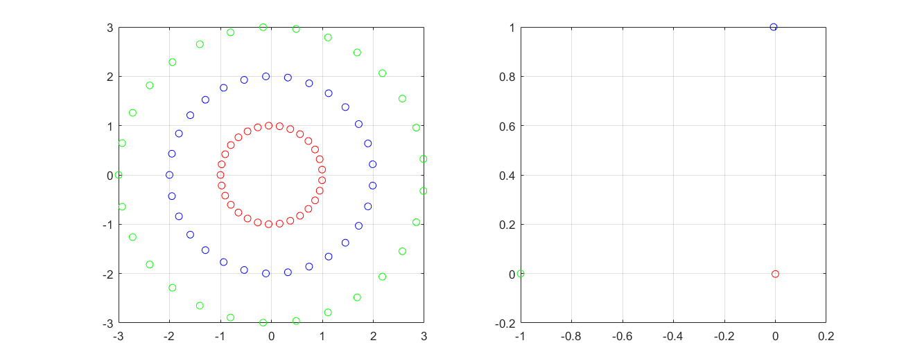
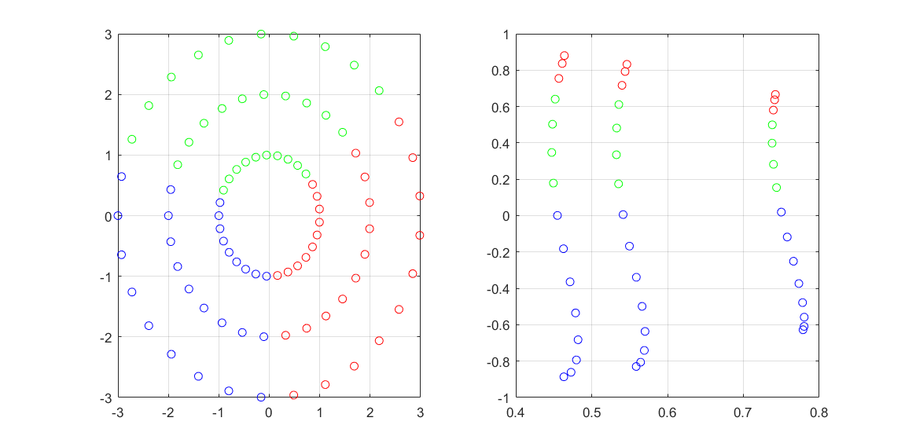

% Esercitazione 5
% Edoardo Ferrante; Federico D'Ambrosio

# Analisi dei gruppi

L'obiettivo della quinta esercitazione era di analizzare gli algoritmi di clustering e provarne l'accuratezza in relazione agli iperparametri.

## K-means
Il primo algoritmo analizzato è il cosidetto K-means, il quale necessita di $K$ come ingresso, ovvero il numero di classi in cui suddividere i nostri dati, e i punti da classificare.
L'algoritmo viene inizializzato con $K$ centroidi presi in maniera casuale fra i dati a disposizione. Quindi, per ogni punto dell'insieme viene trovato il centroide più vicino e la distanza da esso.
Ogni centroide viene dunque centrato rispetto ai punti che dovrebbe contenere facendo una media sulle posizioni dei suoi punti.
Calcoliamo la distanza intraclasse come media delle distanze minime da ogni classe dei punti, quindi usiamo questa misura per vedere quanto i centroidi, e quindi le classi, si siano modificati; se la distanza cambia, allora, le classi sono cambiate e occorre fare un'ulteriore iterazione dell'algoritmo, partendo dal calcolo delle distanze dei punti dai cluster, altrimenti l'algoritmo si ferma.
La distanza intraclasse, inoltre, ci dà un'idea della qualità della clusterizzazione. Un numero piccolo indica una clusterizzazione migliore poiché pochi punti sono distanti dal loro centroide.

Questo algoritmo funziona bene solo per gruppi ben delineati, come punti appartenenti a sfere lontane; in altri casi di cluster ,pur semplici da dedurre con occhi umani, falliscono miseramente, come per esempio dei cerchi concentrici.

### Kernel K-means
Come per la regressione e la classificazione possiamo pensare di portare il nostro problema in uno spazio a più dimensioni per facilitare il nostro compito, analizziamo quindi l'algoritmo di K-means con i kernel gaussiani. 
L'idea dell'algoritmo rimane simile così come l'implementazione, l'unica differenza si vede nel calcolo della distanza tra punti e centroidi, non più euclidea ma basata sul kernel gaussiano e nel fatto che il centroide si trovi nel nostro spazio ad infinite dimensioni.
A differenza del K-means normale non abbiamo quindi la possibilità di visualizzare i centroidi.
Anche questo algoritmo necessita di avere $K$ come input, oltre a volere gli iperparametri $\gamma$ ed il tipo di kernel.

Tuttavia usare il kernel non migliora le prestazioni del K-means, e rende più oscuro l'algoritmo nascondendo i centroidi.

### Ginocchio
Il K-means si rende però utile in un modo, dandogli infatti in ingresso $K$ crescenti partendo da 1 e calcolando la distanza infraclasse per ciascun valore di $K$, possiamo notare come quest'ultima decresca velocemente con la prima fino a trovare un punto oltre la quale decresce più lentamente. Questo punto di ginocchio ha come valore di $K$ il giusto numero di classi in cui bisogna suddividere il nostro insieme di punti.
$K$ passa così da iperparametro ad un numero calcolabile algoritmicamente.

## Analisi spettrale

Lo Spectral Clustering è una tecnica che effettua la classificazione, tramite clustering, di un dataset dopo averne ridotto la dimensionalità, a seguito degli autovettori della matrice di affinità dello stesso dataset.
Per cominciare, la matrice di affinità $A$ è definita come una matrice simmetrica con diagonale nulla ed elemento $A_{ij}$ come segue:

$A_{ij} = \exp(-\frac{||x_i - x_j||^2}{2\sigma^2})$

L'algoritmo seguito in questo esercitazione, poi, definisce le seguenti matrici:

 - $D$ diagonale con ogni suo elemento i-esimo non nullo uguale alla somma della riga i-esima di A, ```D = diag(1./sqrt(sum(A,2)))```;
 - $L= D^{-\frac{1}{2}}AD^{-\frac{1}{2}}$

Si procede poi a trovare i k autovalori più grandi e inserire i corrispondenti autovettori, affiancati, in una matrice apposita $X \in \mathbb{R}^{n \times k}$, normalizzata, poi, in modo da avere ogni riga di lunghezza unitaria.
Ogni riga di questa matrice finale, quindi, può essere trattata come un punto di uno spazio $\mathbb{R}^k$ e, su questo dataset è possibile effettuare una classificazione tramite clustering utilizzando la già menzionata tecnica di K-means, o altre tecniche.

Per analizzare le proprietà dello Spectral Clustering, costruiamo un nuovo dataset formato da campioni distribuiti in modo da formare 3 cerchi concentrici.

Applicando l'algoritmo sopra descritto, è possibile notare che la corretta clusterizzazione è suscettibile al valore di $\sigma$, parametro usato per la costruzione della matrice di affinità. Infatti, solo per valori $\sigma \in [11, 6]$ si ha una classificazione corretta, mentre per altri valori l'algoritmo sbaglia molto grossolanamente.



