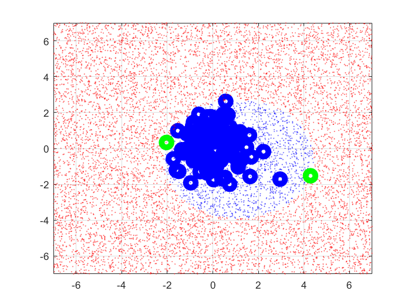
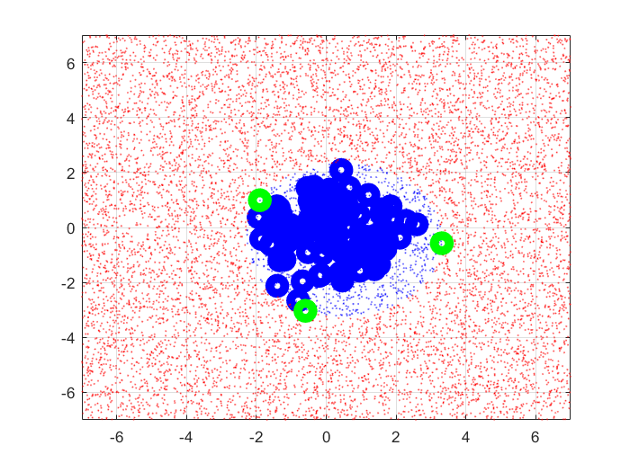

% Esercitazione 3
% Edoardo Ferrante; Federico D'Ambrosio

# Regressione, Classificazione binaria e multiclasse con Support Vector Machine
In questa esercitazione si è utilizzato l'algoritmo di Sequential Minimal Optimization per la fase di addestramento delle Support Vector Machine utilizzate. In particolare, viene usato per la risoluzione di problemi quadratici, cioè problemi del tipo:
$min_{\underline{x}} \frac{1}{2} \underline{x}^T H \underline{x} + \underline{f}^T\underline{x}$, soggetto a vincoli:
$LB \leq \underline{x} \leq UB$
$\underline{a}^T \underline{x} = \underline{b}$.

Dall'applicazione di questo algoritmo troviamo 2 valori particolari:

  - $\alpha$, vettore di moltiplicatori di Lagrange, soluzione ottima del problema quadratico risolto;
  - $b$, valore di bias ottenuto applicabile alla SVM nella fase di forward.  

## Regressione di Sinusoide con intervallo di insensitività

Per trovare il regressore di una sinusoide soggetta a rumore gaussiano, $Y = \sin(10X) + \sigma \; randn(n,1)$ , occorre fissare, per cominciare, i 3 iperparametri della SVM:

 - $\gamma$, iperparametro del kernel gaussiano, che regola come abbiamo visto nella precedente esercitazione la maggiore o minore linearità del regressore;
 
 - $\epsilon$, iperparametro che regola la larghezza dell'intervallo di insensitività intorno al regressore: tutti i punti che cadono entro l'intorno $\epsilon$ del regressore sono considerati corretti;
 
 - $C$, iperparametro di regolarizzazione, regola quanto la SVM impara dagli errori, cioè dai punti che cadono al di fuori dell'intervallo di insensitività.

Fissati tali valori, facciamo risolvere all'algoritmo il nostro problema quadratico fissando i parametri che caratterizzano lo stesso:

 - $H = \exp(\text{pdist2(X,X)});\; H = \begin{bmatrix}
										H & -H \\
										-H & H \\
										\end{bmatrix}$;
 - $f = \begin{bmatrix}
		\epsilon - \underline{Y} \\
		\epsilon - \underline{Y} \\
		\end{bmatrix}$;
 - $a = \begin{bmatrix}
		\mathbb{I} \\
		-\mathbb{I} \\
		\end{bmatrix}$;
 - $LB = \underline{0}$;
 - $UB = \underline{C}$.

Come risultato dal SMO otteniamo $\underline{\alpha}$, come già detto, soluzione ottima del problema, e $b$, il bias applicabile al regressore.
Possiamo, quindi, calcolarci il regressore:

	XF = linspace(-1,1,1000)';
	YF = exp(-gamma*pdist2(XF,X)) * alpha + b;

Al variare degli iperparametri, lasciando gli altri a valori ragionevoli, possiamo vedere che:

 - al variare di $\gamma$:
 
    - con $\gamma$ molto grande, il regressore è altamente non lineare e cerca di adattarsi ai punti al di fuori dell'intervallo di insensitività;
    - con $\gamma$ molto piccolo, il regressore è praticamente una retta costante in 0 ed è quindi estremamente lineare.
  Questi risultati confermano quanto già osservato nella precedente esercitazione.
  
 - al variare di $\epsilon$:
 
    - con $\epsilon$ troppo grande, il regressore non impara mai, visto che i punti all'esterno dell'intervallo di insensitività sono molto pochi;
    - con $\epsilon$ troppo piccolo, il tubo di insensitività è praticamente nullo e il regressore considera errori da cui imparare tutti i punti
 - al variare di $C$:
 
    - con $C$ molto grande, il regressore è molto spezzettato in quanto cerca di adattarsi al maggior numero possibile di dati (analogamente al $\lambda$ molto piccolo delle precedenti esercitazioni) che non si trovano nell'intervallo di insensitività;
    - con $C$ molto piccolo, il regressore è una costante in 0, a riprova del fatto che vengono ignorati i dati (analogamente al $\lambda$ molto grande delle precedenti esercitazioni).

\pagebreak
	
## Classificazione binaria 
### Classificatore a sfera su iperspazio
Per effettuare la classificazione di $n=100$ punti appartenenti a una sfera, dopo aver generato il dataset, come nel caso precedente, utilizziamo l'algoritmo di Sequential Minimal Optimization, questa volta usando come parametri:

 - $H = 2 X X^T$;
 - $f = - \frac{1}{2} diag(H)$;
 - $a = \begin{bmatrix}
		\mathbb{I} \\
		\end{bmatrix}$;
 - $LB = \underline{0}$;
 - $UB = \infty$.

Grazie alla soluzione ottima di SMO $\alpha$ possiamo calcolarci il centro della sfera a cui appartengono i punti e troviamo il raggio di tale sfera, equivalente alla distanza del punto appartenente al dataset più lontano dal centro:

	a = X' * alpha;
	R = max(pdist2(X,a'));

Disegnando su grafico la sfera di raggio $R$, appena calcolato, possiamo vedere che tutti i punti del dataset sono all'interno della sfera, ad eccezione di 3 punti (che possono diventare 2 in alcune esecuzioni) che si trovano
alla frontiera della sfera.

 \ 

Analizzando la soluzione, $\alpha$, possiamo vedere che tutti i punti, eccetto quelli sulla frontiera, hanno la corrispettiva componente di $\alpha$ nulla, mentre la somma delle componenti diverse da 0 è uguale a $1$.
Questo risultato conferma quanto visto a lezione in merito alle condizioni KKT in questo problema specifico di classificazione binaria con una sfera.

Infatti, dal Lagrangiano primale del problema originario di minimizzazione:

$L_p(\underline{a}, R^2, \underline{\alpha}) = R^2 - \sum_{i} \alpha_i (R^2 - ||\underline{x}_i - \underline{a}||^2)$

con $\alpha_i \geq 0$

si ottengono le condizioni KKT:

$\frac{\partial L_p}{\partial \underline{a}} = 0 \implies \underline{a} = \sum_{i} \alpha_i \underline{x}_i$, condizione che deve rispettare il centro della sfera;

$\frac{\partial L_p}{\partial R^2} = 0 \implies \sum_{i} \alpha_i = 1$, condizione che il vettore di moltiplicatori $\underline{\alpha}$ deve rispettare.

### Conferma risultati precedenti
	main3
	main4
## Classificazione multiclasse
	main6