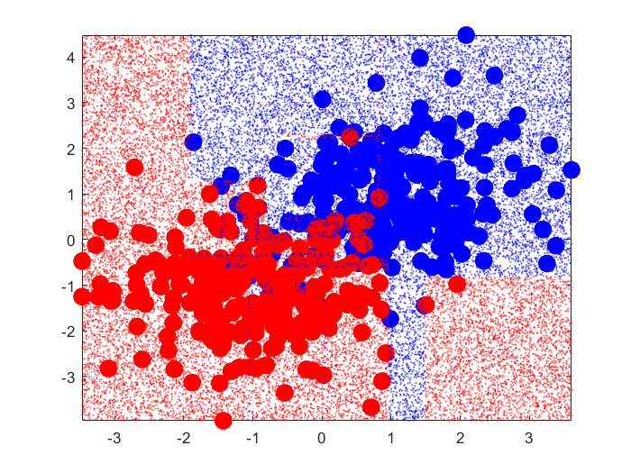
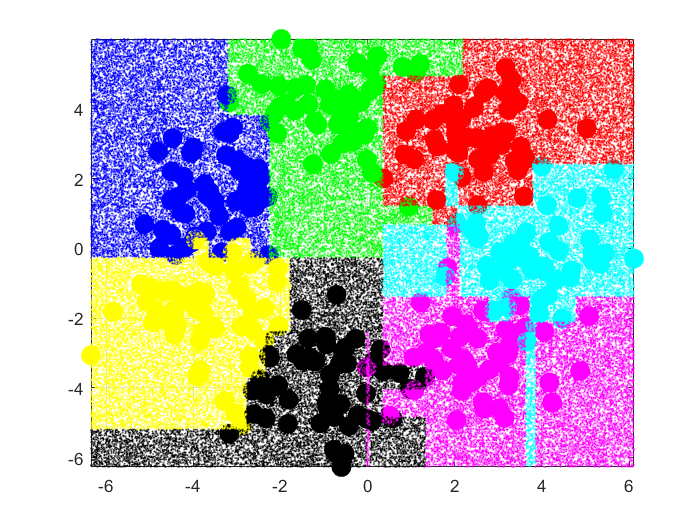
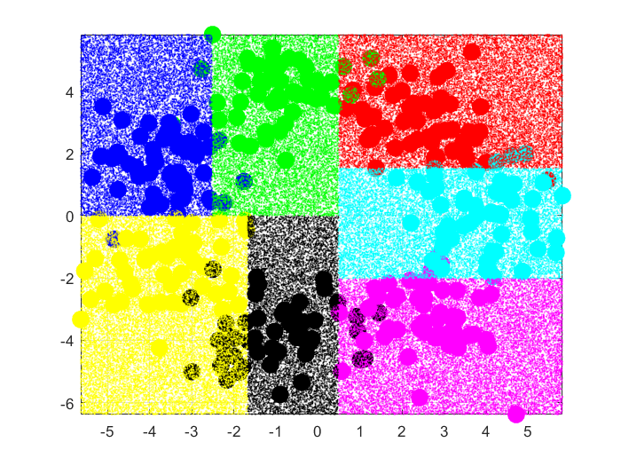

% Esercitazione 4
% Edoardo Ferrante; Federico D'Ambrosio

# Classificazione multiclasse con alberi decisionali e foreste

## Alberi decisionali

Gli alberi decisionali sono grafi che sono usati per la classificazione attraverso l'uso di tagli, operati nei nodi degli stessi, su una features dei campioni del dataset.
Tale feature, scelta per ogni nodo tra tutte le features dei campioni, è quella che fornisce il maggiore guadagno entropico G.

$G = H(A) - (\frac{n_{B1}}{n_A} H(B_1) + \frac{n_{B2}}{n_A} H(B_2))$ 

con $H(Y) = - \sum_{i} p_i \log(1-p_i)$ e $p_i$ la probabilità che un elemento di classe $i$ sia all'interno dell'insieme Y.  

### Fase di addestramento

La costruzione di un albero, per il quale l'unico iperparametro è la profondità/altezza, è ricorsiva e, per questo, si comincia dal determinare la condizione di arresto della ricorsione.
Questa non sarà altro che la disgiunzione di due condizioni: 

  - l'altezza dei sotto-alberi ancora da creare è $0$, che significa che siamo arrivati alle foglie, l'altezza massima del nostro albero; 
  - la presenza di elementi di una sola classe all'interno dell'insieme di campioni che consideriamo, che implica che non ci sia più nulla da classificare.

Se siamo giunti ad una situazione di stop, quindi, possiamo classificare tutti i campioni che soddisfano i tagli dettati dal percorso fino alla foglia in esame che, graficamente è un settore squadrato dello spazio, etichettandoli con la classe che è maggiormente presente in tale settore.

\pagebreak

Invece, durante la normale ricorsione della creazione dell'albero si segue la seguente procedura:

  1. $G_{best}$, il guadagno entropico in tale nodo viene inizializzato a $-\infty$;
  2. Per ogni feature i-esima, i campioni vengono ordinati in base a tale feature;
  3. Considerate, ora, le etichette dei campioni ordinati, se due etichette contigue sono diverse, allora, si calcola il guadagno entropico che si avrebbe nel passaggio da uno all'altro;
  4. Se il guadagno appena calcolato, $G$, è maggiore di $G_{best}$, allora $G_{best} = G$ e si effettua un taglio tra i 2 campioni relativi alle 2 etichette che stiamo considerando.

Alla fine di tale procedura, avremo scelto una feature, $f$, la quale sarà la feature migliore possibile, in termini di guadagno di informazione per il nodo corrente, e un taglio relativo a tale feature, $cut$. 
Di conseguenza, possiamo procedere nella ricorsione dividendo tutti i dati in modo tale che vengano creati dei nuovi sottonodi: il figlio destro, che conterrà tutti i dati che hanno $X[f] < cut$, e il figlio sinistro, con $X[f] \ge cut$.
  
### Fase in avanti

Una volta terminata la fase di addestramento, e, quindi, la costruzione dell'albero decisionale, dato un dataset possiamo effettuarne la classificazione semplicemente esplorando l'albero costruito in precedenza:
 
  1. Per ogni campione da classificare, esploro l'albero: se il nodo corrente è una foglia, associo la classe della foglia come etichetta del campione in esame;
  2. altrimenti, se il taglio, associato alla feature del nodo corrente, è maggiore del valore della corrispondente feature del campione, esploro il sotto-albero destro, altrimenti, il sinistro.

\pagebreak
  
### Risultati

Nel caso di classificazione binaria, possiamo vedere che la divisione non è ottimale, visto che i tagli costruiti dall'albero sono delle rette costanti, la divisione dei campioni classificati è in settori squadrati, 
ben lontana dall'ottimale separatore lineare, in termini di accuratezza.

Nel caso di classificazione multi-classe (in particolare, 7 classi), analogamente al caso precedente, notiamo che i settori sono sempre squadrati. Notiamo, inoltre, come ci possiamo ragionevolmente aspettare che, aumentando
o diminuendo l'altezza massima dell'albero, aumenta e diminuisce la frammentazione, e quindi l'accuratezza, dei settori calcolati. Infatti, a una maggiore altezza equivale un maggior numero di tagli.
Nelle immagini sottostanti è possibile notare la differenza tra un'altezza massima uguale a 10, e una uguale a 3.

 \ 

\pagebreak

## Random forest

## Un caso reale: classificazione di vini
