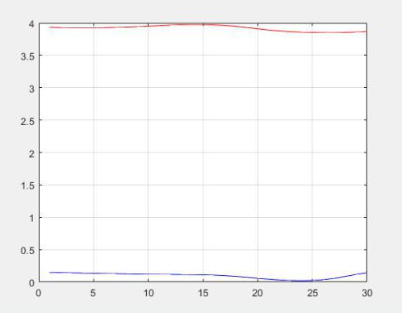

% Esercitazione 1
% Edoardo Ferrante; Federico D'Ambrosio

# Il valore di $\pi$ : stima e confidenza

## Stima del valore di $\pi$
La prima parte dell'esercitazione verte sulla ricerca del valore di $\pi$ modellando tale valore come la probabilità $P$ che, all'interno di un riferimento cartesiano con origine nel centro di un cerchio di raggio unitario inscritto in un quadrato, un punto di coordinate $(x, y), x,y \in (0,1)$, si trovi o meno all'interno dell'area del cerchio.
Infatti, si ha che: $P=\frac {\pi}{4}$, da cui possiamo ottenere $\pi= 4P$ e dedurre che, conoscendo il valore della probabilità $P$, possiamo ricavare il vero valore di $\pi$.
Si è proceduto, quindi, a generare casualmente una quantità fissata $n$ di punti, memorizzati in un vettore apposito,
```Matlab
%% vettore 2 x n, ogni colonna è un punto
point = rand(2,n); 
```
dal quale procediamo, poi, a contare il numero di punti che hanno distanza dall'origine $\leq 1$
```Matlab
inside = sum(sum(point.*point) <= 1);
```
per poi utilizzare tale valore per calcolare quello di $\pi$ che volevamo trovare. 
```Matlab
empirical_pi = 4 * inside/n;
```
I risultati ci permettono di intuire che all'aumentare di $n$, cioè dei campioni a nostra disposizione, aumenta anche la precisione del valore stimato di $\pi$; e, in particolare, per aumentare la precisione di un fattore $N$, dobbiamo aumentare il numero di 
campioni di un fattore $N^2$.
È importante evidenziare che tali risultati, ottenuti per $n$ sempre maggiori, non sono altro che stime, a cui siamo costretti a ricorrere per la natura finita di un singolo esperimento (quantità fissata di campioni $n$).

\pagebreak

## Teorema di Čebyšëv: accuratezza e confidenza

Per quanto detto sopra, possiamo ripetere l'esperimento un numero $m$ di volte, generando per ogni $m$-esimo ciclo un nuovo insieme di punti da utilizzare per stimare $\pi$.
In questa nuova situazione, possiamo analizzare la relazione che sussiste tra l'accuratezza e la confidenza, relazione evidenziata nella disuguaglianza di Čebyšëv:

$\Pr\left(|{\bar{x}-\mu}| \ge \epsilon\right)\le \;\delta$

con

$\delta = \frac{\sigma_x^2}{n\cdot\epsilon^2} \; \; \; \epsilon = \sqrt{\frac{\sigma_x^2}{n\cdot\delta}}  \; \; \; \sigma_x^2 = varianza\,di\,x$

che può essere riscritta come

$\Pr\left(|{\bar{x}-\mu}| \le \epsilon\right)\ge \;1-\delta$

Questa disuguaglianza afferma che la probabilità $\delta$ (confidenza) che la realizzazione di una variabile aleatoria $x$ cada al di fuori di un intervallo simmetrico, attorno al suo valore medio $\mu$, di ampiezza $2\epsilon$, è inversamente proporzionale al numero di campioni a disposizione.
Per effettuare, quindi, la nuova analisi abbiamo bisogno di $\sigma^2_x$, per poter ricavare $\epsilon$. Per fare questo, maggioriamo il suo valore sfruttando la definizione della varianza:

$\sigma^2_x = E_x\{x^2\} - \mu^2 \le\mu-\mu^2=\mu ( 1 - \mu ) \le \frac{1}{4}$

Tale maggiorazione è giustificata dal fatto che:

- $x^2 \le x \in [0,1] \implies E_x\{x^2\} \le E_x\{x\} = \mu$
- $\mu$ è una variabile aleatoria $\in [0,1]$, per cui $\sigma^2_x$ ha come valore medio $\frac{1}{2}$ 
- $\sigma^2_x (\mu) =\mu ( 1 - \mu )$ è una funzione concava che ha come massimo $\mu = \frac{1}{2} \implies \sigma^2_x = \frac{1}{4}$

Possiamo, quindi, fissato un $\delta$ obiettivo, trovare $\epsilon$ e usarlo per calcolare la vera accuratezza del risultato degli $m$ esperimenti:

```Matlab
delta = 0.05;
m = 1000000;
sigma2 = 1/4;
epsilon = sqrt(sigma2/(n*delta));
%% All'interno del ciclo, per ogni esperimento da 1 a m
    if (abs(empirical_pi - pi) > 4*epsilon)
        true_delta = true_delta + 1;
    end
%% Fuori dal ciclo
true_delta = true_delta / m;
```
Tuttavia, si ottiene sempre che $\delta_{true} = 0$, questo perché le condizioni imposte da Čebyšëv sono troppo conservative, poco sensibili alla variazione di $n$, e il vero $\delta$ è molto più piccolo di quello stimato. Intuiamo, quindi, che Čebyšëv non è sufficiente 
per effettuare una stima abbastanza veritiera del $\delta$ e per questo si introduce la Disuguaglianza di Hoeffding:

$\Pr\left(|{\bar{x}-\mu}| \ge t\right)\le \;2e^{-2nt^2} = \delta \implies \epsilon = t = \sqrt{\frac{log(\frac{2}{\delta})}{2n}}$

Per cui, il delta stimato imponendo `epsilon = sqrt(log(2/delta)/(2*n))` è molto più vicino al $\delta$ vero.


\pagebreak

# Stima di una funzione: regressore, insieme dei dati ausiliari, analisi dell'errore al variare di complessità e di $\lambda$

## Stimatore di funzione
La seconda sezione dell'esercitazione è incentrata, invece, sull'identificazione e ottimizzazione di estimatori di funzione e all'analisi del bilanciamento tra complessità ed errore in funzione del rumore e della quantità di dati a nostra disposizione.
Abbiamo quindi iniziato l'esercitazione generando la *vera funzione*.
```Matlab
x_true = linspace(0,1,1000)';
y_true = x_true.^2;
```
Successivamente abbiamo definito x come un vettore contenente una campionatura casuale lineare in contrasto con la x vera ovvero quella equispaziata lineare usato per la funzione vera
```Matlab
x = rand(n,1)
```
dove n è la cardinalità dell'insieme dei dati, generiamo quindi l'insieme dei dati simulando la funzione vera $y = x^2$, aggiungendovi un rumore gaussiano con media 0 e varianza $\sigma$.
```Matlab
y = x.^2 + sigma*randn(size(x));
```

Presupponendo quindi di costruire uno stimatore polinomiale $\hat{y_p}= \sum_{i=0}^{p} c_i x^i$ dove $p$ è la complessità scelta dello stesso.
Conoscendo, dunque, il vero sistema, abbiamo deciso di provare $p$ fra $0$ e $3$ per vedere la relazione tra l'errore dello stimatore e il numero di campioni a disposizione per ognuna di tali complessità.

Necessitiamo quindi di $c_0, c_1, c_2$ e $c_3$, che calcoliamo tramite
 $c_i = (X_i^TX_i)^+ X_i^T y$
 
$X_i =  \begin{bmatrix}
  1 & x & x^2 & \cdots & x^i \\
  1 & x & x^2& \cdots & x^i\\
\vdots & \vdots& \vdots&\ddots&\vdots\\
  1 & x & x^2 & \cdots & x^i
 \end{bmatrix}$
 
Trovati gli stimatori per ogni $p$,
 
```Matlab
A = ones(size(xx));
yy0 = A*c0;
A = [A,x_true];
yy1 = A*c1;
A = [A,x_true.^2];
yy2 = A*c2;
A = [A, x_true.^3];
yy3 = A*c3;
```

calcoliamo per ognuno l'errore rispetto alla funzione vera:

```Matlab
e0 = sqrt(mean((yy-yy0).^2));
e1 = sqrt(mean((yy-yy1).^2));
e2 = sqrt(mean((yy-yy2).^2));
e3 = sqrt(mean((yy-yy3).^2));
```
Possiamo così analizzare come, al variare della dimensione del insieme dei dati e della quantità del rumore, cambi la complessità ottima del nostro stimatore.

Al variare di $\sigma$:

- con $\sigma$ molto alto ($\sigma = 10$), rispetto al numero di campioni nel insieme dei dati abbiamo che l'errore minimo è dato dal modello costante (polinomio di grado 0).
 Aumentando il numero di campioni:
 
    - con $n = 5000$, il regressore lineare è quello ottimale;
    - con $n = 10000$, diviene ottimo il modello quadratico;
    - per nessun $n$ finito può venire che il modello di terzo grado sia migliore di quello di secondo.

- con $\sigma$ "ragionevole" ($\sigma = 2$), il regressore quadratico è quello ottimale.
 
Sicché, abbiamo concluso che, all'aumentare dei dati e, analogamente, al diminuire del rumore la complessità dello stimatore aumenta fino a raggiungere il massimo nel grado della funzione vera.

## Insieme dei dati ausiliari e stimatore dell'errore

Avendo queste informazioni sul minimo dobbiamo però considerare che, in uno scenario reale non avremo una vera funzione su cui calcolare l'errore e trovare, quindi, la complessità ottima e per questo, siamo costretti a trovare una stima della funzione vera.
Si procede, quindi, a considerare l'intero insieme dei dati di campioni a disposizione diviso in 2 sottoinsiemi: l'insieme di addestramento, di cardinalità $n_{train}$, che usiamo per stimare i valori dei parametri della funzione, e l'insieme di testing, di cardinalità $n_{test}$ che usiamo per calcolare i regressori
che useremo poi per calcolare l'errore.
A questo punto, possiamo effettuare l'analisi, considerando ancora la funzione vera a disposizione, e possiamo fare un confronto degli errori calcolati, al variare della complessità $p$, usando le 3 funzioni che abbiamo: $y_{true}$, $y_{train}$ e $y_{test}$.

```Matlab
% j-esimo ciclo da 0 a p
% Calcolo dei parametri dello stimatore della funzione
c = (A'*A)\A'*y_train; 
% Calcolo del regressore di grado j, con l'insieme di addestramento
A = [A, x_train.^j]; 
 % Calcolo dell'errore, usando l'insieme di addestramento
err(1, j+1) = err(1, j+1) + sqrt(mean((y_train - A*c).^2));
% Calcolo del regressore di grado j, con la funzione vera
B = [B, x_true.^j]; 
% Calcolo dell'errore, sconosciuto, usando la funzione vera
err(2, j+1) = err(2, j+1) + sqrt(mean((y_true - B*c).^2)); 
% Calcolo del regressore di grado j, con l'insieme di testing
C = [C, x_test.^j]; 
% Calcolo dell'errore, usando l'insieme di testing
err(3, j+1) = err(3, j+1) + sqrt(mean((y_test - C*c).^2)); 
```

I risultati ottenuto dal codice di cui sopra ci permettono di dire che:

 - l'errore calcolato tramite l'insieme di addestramento diminuisce all'aumentare del grado del polinomio considerato: questo errore è *polarizzato* perché lo stiamo calcolando usando dati già usati per la stima dei parametri dello stimatore;
 - l'errore calcolato tramite l'insieme di testing segue l'andamento dell'errore calcolato tramite la funzione vera, fornendoci una buona approssimazione a meno di una costante $\sigma$;
 - in presenza di rumore molto grande il modello migliore risulta essere quello di grado 0, la costante.
 
 Possiamo analizzare, adesso, come varia la stima dell'errore al variare sia del numero di campioni nel insieme di addestramento, usando un vettore `n_train = [10, 20, 40, 100, 200, 400, 1000]`, sia del grado del polinomio considerato.
 Calcoliamo, quindi, per ogni numero di campioni fissato, l'errore per ogni polinomio di grado $j$, da 0 a 5. 
 
 Dai risultati intuiamo che:
 
  - con una piccola quantità di campioni conviene scegliere la funzione di regressione con complessità minore;
  - all'aumentare del numero di campioni è possibile scegliere una funzione di regressione con complessità sempre maggiore, fino ad arrivare, al massimo, a quella della funzione vera (in realtà, sconosciuta).

## Stimatore polarizzato dell'errore

Avendo visto le relazioni fra complessità, errore e quantità di campioni possiamo pensare di introdurre la stessa complessità all'interno della definizione del problema, tramite la norma del vettore delle costanti, in modo da poter controllare più facilmente il bilanciamento fra complessità e precisione.

Aggiorniamo quindi la definizione dell'errore da minimizzare:

$||\underline{y}-X \underline{c}||^2 + \lambda ||\underline{c}||^2$

e quindi dei coefficienti, rendendoli:

$c_i = (X_i^TX_i + \lambda \mathbb{I} )^+ X_i^T y$

Dove $\lambda$ rappresenta la nostra fiducia nella qualità dei dati; infatti assegnando ad essa un valore alto, nella minimizzazione daremo un peso maggiore alla complessità, mentre se le diamo un valore più basso la minimizzazione si incentrerà di più sull'adattarsi ai dati a disposizione.

Avendo già considerato in precedenza gli effetti della modifica della cardinalità dell'insieme dei dati, della $\sigma$ del rumore e della complessità del modello, li manterremo costanti: precisamente $n_{train} = 10$, $\sigma = 2$ e $p = 5$; altresì varieremo la $\lambda$.

Provando con una $\lambda$ molto bassa, uguale a $0.01$, fidandoci quindi dei nostri dati troviamo un errore fra la funzione vera e quella stimata che è una funzione diversa ad ogni realizzazione dell'esperimento, la quale presenta valori di notevole grandezza.

Provando con una $\lambda$ più alta, uguale a $5$, riducendo quindi la nostra fiducia, troviamo una serie di funzioni di errori più similari fra loro, più regolari e che non raggiungono valori troppo alti.

Infine provando con una $\lambda$ molto alta, uguale a $100$, sostanzialmente non curandoci dei dati, troviamo una serie di funzioni omogenee che rispecchiano la differenza tra una funzione quadratica (quella vera) e una costante in $0$ (ovvero quella che il nostro regressore di quinto grado sta approssimando con i c trovati minimizzando $\lambda$)

Quindi in questo caso, nel quale il rumore non è di entità trascurabile e l'insieme dei dati è molto ristretto possiamo dedurre che non fidarsi dei dati possa essere favorevole.

Per poter trarre conclusioni più accurate però, abbiamo deciso di costruire un esperimento finale che unisse quanto visto nel resto delle esercetazioni sui regressori con queste statistiche:

```Matlab
sigma = 2;
n_true = 1000;
n_train = 100;
n_test = 100;
lambda = 100;
p = 9;

 x_train = rand(n_train,1);
 y_train = x_train.^2 + sigma*randn(size(x_train));
 
  x_test = rand(n_test,1);
 y_test = x_test.^2 + sigma*randn(size(x_test));
 
 x_true = linspace(0,1,n_true)';
 y_true = x_true.^2;


```

Quindi proviamo per trenta valori di $\lambda$ spaziati logaritmicamente fra $10^{-4}$ e $10^3$ come vari l'errore mantenendo costanti gli altri valori del problema.
Così potremo vedere per quale valore di $\lambda$ si trovi il valore minimo dell'errore.
Inoltre costruiamo uno stimatore dell'errore per vedere se il minimo dello stimatore si trovi per la stessa $\lambda$ dell'errore vero e quindi da questo si possa trovare un valore utile.

Quindi disegnando i nostri grafici otteniamo che per ogni realizzazione dell'esperimento, i valori dell'errore vero e dello stimatore, benché aventi valori diversi distanti fra loro un numero correlato positivamente con l'entita del rumore, hanno mostrato avere il minimo per valori di $\lambda$ molto simili.
Pertanto si conclude che la minimizzazione rispetto a $\lambda$ dello stimatore dell'errore fornisce un buon valore per questa costante. 




La distanza fra i minimi delle due funzioni può essere ascritta al fatto che utilizziamo variabili aleatorie e quindi abbiamo un intervallo attorno all'errore vero e una certa confidenza.


